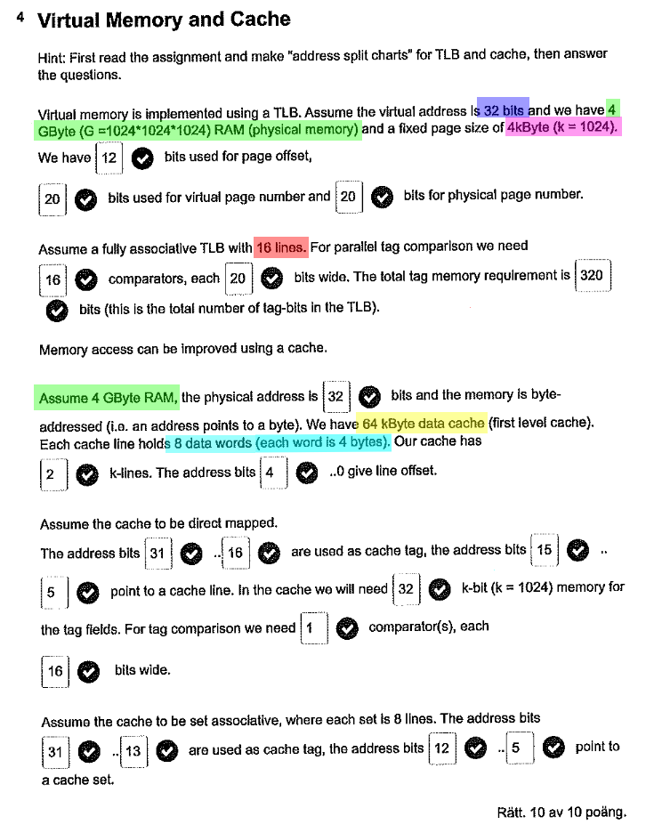

# Virtual Memory and Cache

## Översikt

Så det här är alla tal som kan ändras i Uppgiften, 
utifrån dem går allt annat att räkna ut om man vet hur, 
jag tänker gå igenom alla tal och hur de hänger ihop.

## Page size

Vi tittar först på de första tre talen. 
Alla dessa påverkas endast av virtuellt-, fysiskt minne och page size (blå, grön och magenta).

Eftersom våran mips är 32 bits så är virtuellt minne 32 bitar, 
alltid, denna kommer aldrig ändras.

Fysiskt minne däremot ändras beroende på hur mycket RAM vi har, 
i detta fall har vi 4GB RAM vilket är 2^32 bytes.*\
Detta innebär då att även våran fysiska adress är 32 bitar stor; 
alltså exponenten i 2^32 är 32.

Det sista talet är page size, detta är 4kB vilket är 2^12 bytes.*
Här betyder exponenten i 2^12 att page offset är 12 bitar stor.

Vi kan nu fylla i de första tre talen i bilden.
Notera att vi har lite tur att både virtuellt och fysiskt minne är 32 bitar
vilket ger oss samma page number för båda.
Detta är definitivt inte alltid fallet.
* Offset = 12 bitar
* Virtual page number = virtuellt minne - page offset = 32 - 12 = 20 bitar
* Physical page number = fysiskt minne - page offset = 32 - 12 = 20 bitar

\* Bra att memorera att 2^32 = 4GB och 2^12 = 4kB, 
då är det lätt att ta reda på dessa om de ändras i uppgiften,
ex 2^33 = 8GB, 2^31 = 2GB och 2^13 = 8kB, 2^11 = 2kB.

## Tags
De nästa tre talen är relativt straight forward,
de påverkas endast av lines (röd) och den virtuell 
page vi räknade ut tidigare.

Först får vi reda på hur många lines vi har vilket innebär att vi har
så många lines som behöver jämföras. 
Därav är antalet lines = antalet Comparisons.
Så det hämtar vi bara från frågan vilket är 16 i detta fall.

Det andra numret kan vi som tur är också bara hämta.
Bredden av en line kommer direkt från bredden av virtual page number.
Den har vi redan räknat ut till 20 bitar, det viktiga är att vi kommer ihåg
att det är *virtual* page number och inte *physical* page number.

Det sista numret är nu lätt att räkna ut. Det är helt enkelt bara
_comparators_ * _lines_. I detta fall är det 16 x 20 = 320 bitar.

Vi kan nu fylla i de tre talen i frågan.
* Comparators = lines = 16
* Line width = virtual page number = 20 bitar
* Tag width = comparators x line width = 16 x 20 = 320 bitar

## Lines